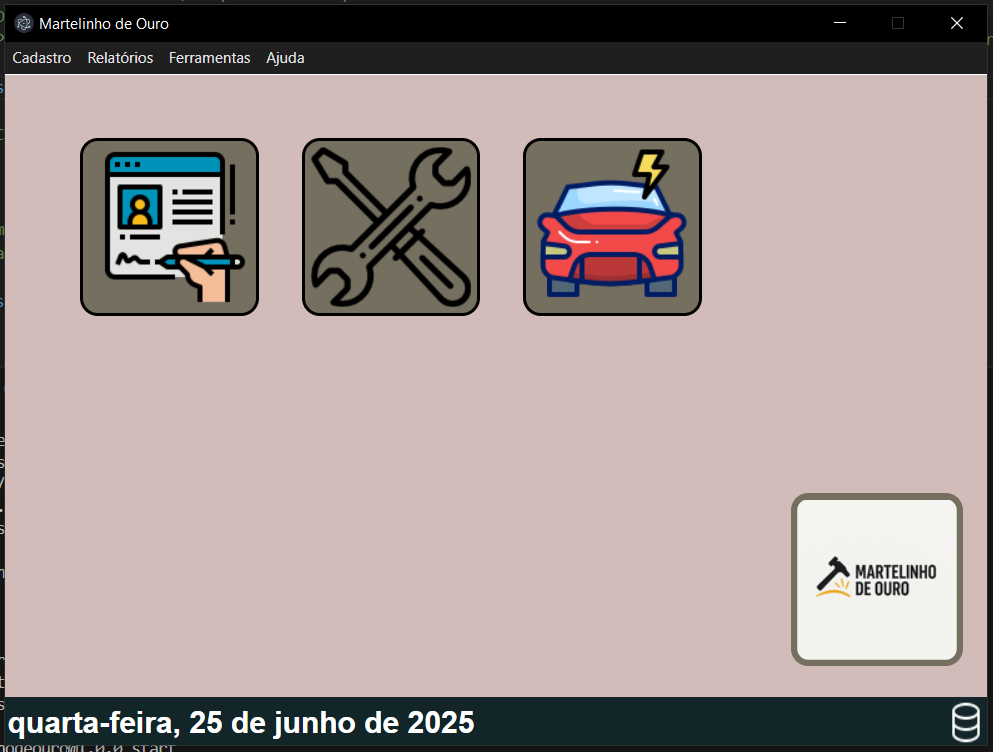

# Martelinho-de-Ouro-
Sistema desktop completo para oficinas, com controle de OS, cadastro de clientes e veículos, geração de relatórios em PDF e interface moderna, desenvolvido com Electron e MongoDB.

### Tela Inicial

## Autor
Murillo Mendonça Mascarenha

## Pré-requisitos de instalação:
Windows 10 ou superior;
Ter o banco de dados MongoDB instalado
## Instalação do MongoDB:
Acesse o site oficial: 

Baixe o MongoDB Community Server e instale com a opção de "Install MongoDB as a Service" ativada (instalação padrão).

Após instalar, ele inicia automaticamente.

## Instalação do sistema Martelinho-de-Ouro-
Em releases faça o download da última versão (.exe) disponibilizada e execute no computador.
